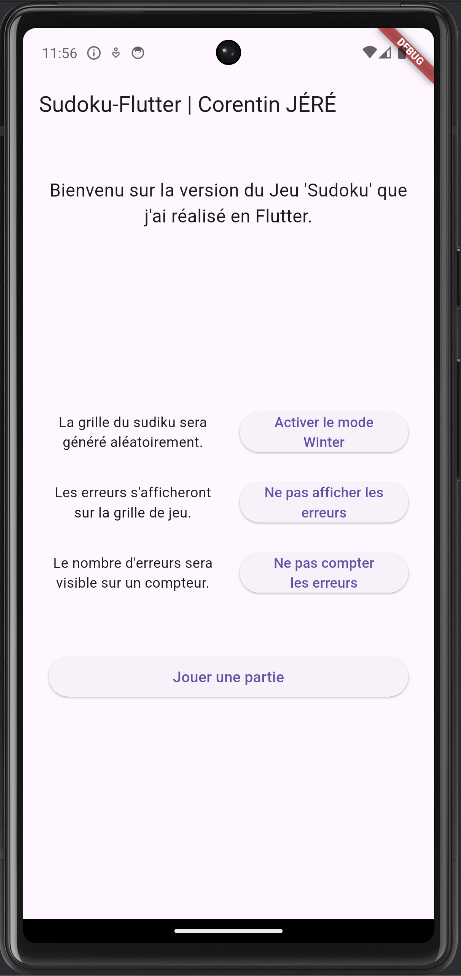
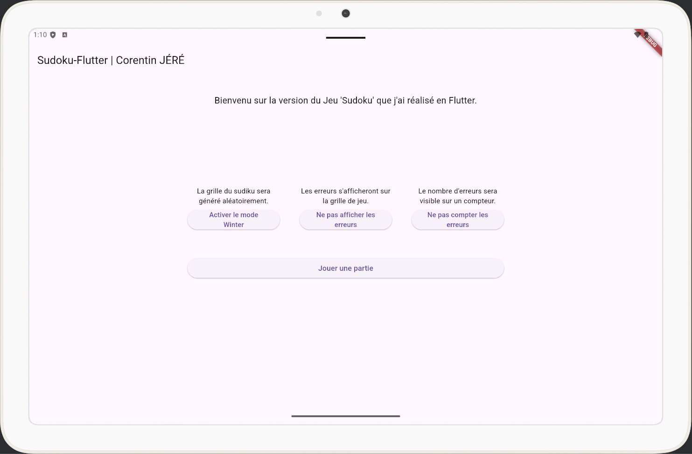
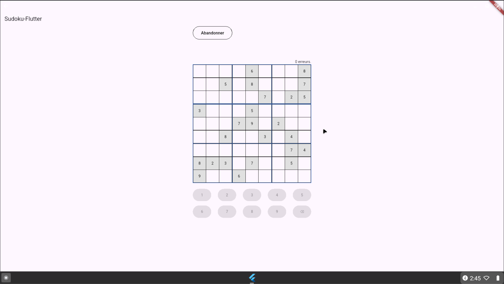
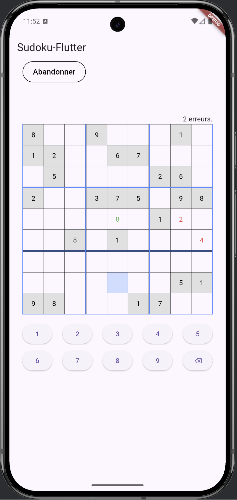
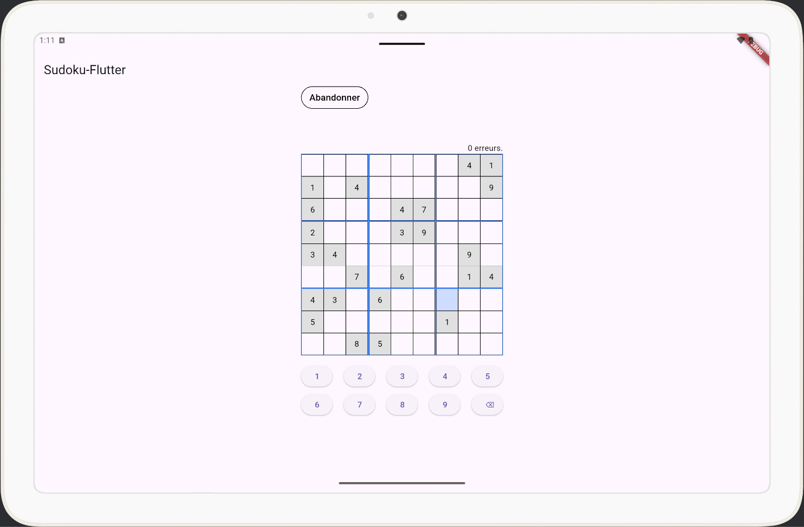
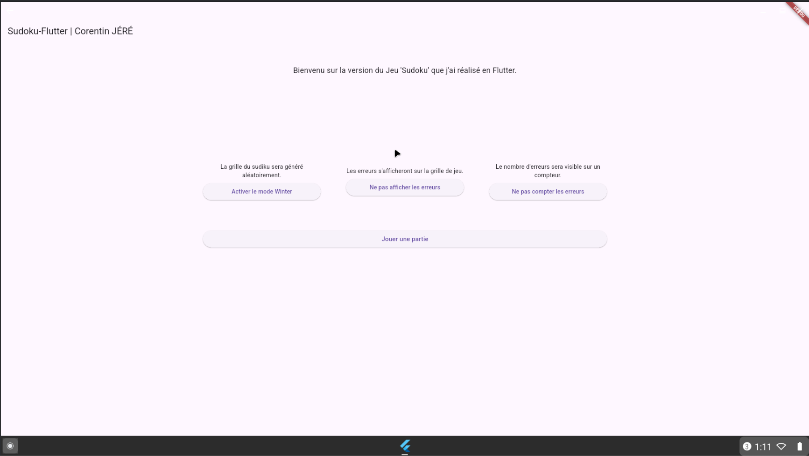

# 🧩 Sudoku Flutter

[](https://CJs0800.github.io/Sudoku_Flutter/)
[](https://flutter.dev/)
[](https://dart.dev/)
[](#plateformes-supportees)
[](#design-responsive)
[](https://github.com/CJs0800/Sudoku_Flutter/releases/tag/2.0.0)
[](https://en.wikipedia.org/wiki/All_rights_reserved)

---

<details>
  <summary><h2>README Français</h2></summary>

> **⮕ Démo en ligne :** https://CJs0800.github.io/Sudoku_Flutter/
> --

Sudoku Flutter est un jeu de Sudoku multiplateforme développé avec Flutter.\
Il fonctionne sur Web, Android, iOS, Windows, macOS et Linux à partir d'un code unique.

---

## Plateformes supportées

- ✅ Web ([ GitHub Pages ](https://CJs0800.github.io/Sudoku_Flutter))
- ✅ Android
- ✅ iOS
- ✅ Windows
- ✅ macOS
- ✅ Linux

---

## Fonctionnalités

- 🧩 Grille de Sudoku interactive
- 🎲 Génération aléatoire de grilles
- ❄️ Mode prédéfini "Winter"
- ❌ Affichage optionnel des erreurs
- 📊 Compteur d'erreurs activable/désactivable
- 🏆 Écran de victoire
- 📱 Design responsive (mobile, tablette, desktop)

---

## Options de jeu

- 🎲 Mode de génération :
    - Génération aléatoire
    - Mode prédéfini "Winter"
- ❌ Affichage des erreurs :
    - Activation/Désactivation
- 📊 Compteur d’erreurs :
    - Activation/Désactivation

---

## Design Responsive

L’interface s’adapte automatiquement aux différentes tailles d’écran.

<details>
  <summary> <strong>Aperçus Responsive – Déplier pour voir Mobile, Tablette & Desktop</strong>
    <table>
      <tr>
        <th>Mobile</th>
        <th>Tablette</th>
        <th>Desktop</th>
      </tr>
      <tr>
        <td></td>
        <td></td>
        <td></td>
      </tr>
    </table>
  </summary>

### 📱 Version Mobile

<table>
  <tr>
    <th>Home page</th>
    <th>Game Page</th>
  </tr>
  <tr>
    <td>
        
    </td>
    <td>
        
    </td>
  </tr>
</table>

### 📟 Version Tablette

<table>
  <tr>
    <th>Home page</th>
    <th>Game Page</th>
  </tr>
  <tr>
    <td>
        
    </td>
    <td>
        
    </td>
  </tr>
</table>

### 🖥 Version Desktop

<table>
  <tr>
    <th>Home page</th>
    <th>Game Page</th>
  </tr>
  <tr>
    <td>
        
    </td>
    <td>
        
    </td>
  </tr>
</table>
</details>

---

## Installation

```
git clone https://github.com/CJs0800/Sudoku_Flutter.git  
cd Sudoku_Flutter  
flutter pub get  
flutter run -d chrome
```

---

## Déploiement

> Version en ligne :  
> 👉 https://CJs0800.github.io/Sudoku_Flutter/

```
flutter build web --base-href /Sudoku_Flutter/
```

---

## Changelog

> Toutes les modifications importantes apportées à ce projet seront documentées dans ce fichier.

#### [[2.0.0]](https://github.com/CJs0800/Sudoku_Flutter/releases/tag/2.0.0) - Update the responsive design handling for all devices.
#### [[1.4.0]](https://github.com/CJs0800/Sudoku_Flutter/releases/tag/1.4.0) - Add Configuration options for grid and hints
#### [[1.3.0]](https://github.com/CJs0800/Sudoku_Flutter/releases/tag/1.3.0) - Add random starting grid types
#### [[1.2.0]](https://github.com/CJs0800/Sudoku_Flutter/releases/tag/1.2.0) - Update of the display selection in the grid
#### [[1.1.0]](https://github.com/CJs0800/Sudoku_Flutter/releases/tag/1.1.0) - Update of the display values in the grid and the validation check
#### [[1.0.1]](https://github.com/CJs0800/Sudoku_Flutter/releases/tag/1.0.1) - Fix: Android platform
#### [[1.0.0]](https://github.com/CJs0800/Sudoku_Flutter/releases/tag/1.0.0) - First Runnable version

---

## À propos du développeur

Développé par **Corentin JÉRÉ**\
Full-Stack & Cross-Platform Développeur

Passionné par la création d'applications réactives et évolutives utilisant les technologies modernes.

[](https://github.com/CJs0800)
[](https://linkedin.com/in/corentin-jere/)
[](mailto:corentinjere@gmail.com)

</details>

---


<details open>
  <summary><h2>English README</h2></summary>

> **⮕ Live Demo :** https://CJs0800.github.io/Sudoku_Flutter/
> --

Sudoku Flutter is a cross-platform Sudoku game built with Flutter.\
It runs on Web, Android, iOS, Windows, macOS, and Linux from a single codebase.

---

## Features

-   🧩 Playable Sudoku grid
-   🎲 Randomly generated puzzles
-   ❄️ "Winter" preset pattern mode
-   ❌ Optional error highlighting
-   📊 Optional error counter
-   🏆 Victory screen when the puzzle is completed
-   📱 Fully responsive design (mobile, tablet, desktop)

---

## Game Options

-   🎲 Puzzle mode:
    -   Random generation
    -   "Winter" pattern preset
-   ❌ Error display:
    -   Show mistakes directly on the grid
    -   Disable visual error feedback
-   📊 Error counter:
    -   Enable mistake counting
    -   Disable mistake tracking

---

## Supported Platforms

-   ✅ Web ([ GitHub Pages ](https://CJs0800.github.io/Sudoku_Flutter))
-   ✅ Android
-   ✅ iOS
-   ✅ Windows
-   ✅ macOS
-   ✅ Linux

---

## Responsive Design

The UI adapts automatically to different screen sizes and devices.

<details>
  <summary> <strong>Responsive Previews – Expand to view Mobile, Tablet and Desktop</strong>
    <table>
      <tr>
        <th>Mobile</th>
        <th>Tablet</th>
        <th>Desktop</th>
      </tr>
      <tr>
        <td></td>
        <td></td>
        <td></td>
      </tr>
    </table>
  </summary>

### 📱 Mobile

<table>
  <tr>
    <th>Home page</th>
    <th>Game Page</th>
  </tr>
  <tr>
    <td>
        
    </td>
    <td>
        
    </td>
  </tr>
</table>

### 📟 Tablet

<table>
  <tr>
    <th>Home page</th>
    <th>Game Page</th>
  </tr>
  <tr>
    <td>
        
    </td>
    <td>
        
    </td>
  </tr>
</table>

### 🖥 Desktop

<table>
  <tr>
    <th>Home page</th>
    <th>Game Page</th>
  </tr>
  <tr>
    <td>
        
    </td>
    <td>
        
    </td>
  </tr>
</table>
</details>

---

## Getting Started

```
git clone https://github.com/CJs0800/Sudoku_Flutter.git\
cd Sudoku_Flutter
flutter pub get
flutter run -d chrome
```

---

## Deployment

> Live version:\
> 👉 https://CJs0800.github.io/Sudoku_Flutter/

```
flutter build web --base-href /Sudoku_Flutter/
```

---

## Changelog

> All notable changes to this project will be documented in this file.

#### [[2.0.0]](https://github.com/CJs0800/Sudoku_Flutter/releases/tag/2.0.0) - Update the responsive design handling for all devices.
#### [[1.4.0]](https://github.com/CJs0800/Sudoku_Flutter/releases/tag/1.4.0) - Add Configuration options for grid and hints
#### [[1.3.0]](https://github.com/CJs0800/Sudoku_Flutter/releases/tag/1.3.0) - Add random starting grid types
#### [[1.2.0]](https://github.com/CJs0800/Sudoku_Flutter/releases/tag/1.2.0) - Update of the display selection in the grid
#### [[1.1.0]](https://github.com/CJs0800/Sudoku_Flutter/releases/tag/1.1.0) - Update of the display values in the grid and the validation check
#### [[1.0.1]](https://github.com/CJs0800/Sudoku_Flutter/releases/tag/1.0.1) - Fix: Android platform
#### [[1.0.0]](https://github.com/CJs0800/Sudoku_Flutter/releases/tag/1.0.0) - First Runnable version

---

## About the Developer

Developed by **Corentin JÉRÉ**\
Full-Stack & Cross-Platform Developer

Passionate about building responsive and scalable applications using modern technologies.

[](https://github.com/CJs0800)
[](https://linkedin.com/in/corentin-jere/)
[](mailto:corentinjere@gmail.com)

</details>

---

## 📄 License

© 2026 CJs0800. All Rights Reserved.

This project is publicly accessible for viewing purposes only.  
No part of this code may be copied, modified, distributed, or reused without explicit permission from the author.

---


